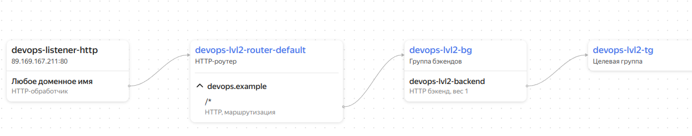

Подготовка инфраструктуры
Для начала создадим необходимую инфраструктуру через интерфейс облачного провайдера. Нам потребуются:

Два сервера
Балансировщик нагрузки
Кластер базы данных
На примере Yandex Cloud инфраструктура может состоять из следующих сервисов:

Compute Cloud - две виртуальных машины с приложением
Virtual Private Cloud - виртуальная сеть для общения сервисов между собой

Группа безопасности VPC со следующими настройками

Группа безопасности балансера - разрешены входящие запросы на 80 и 443 порт для работы приложения, 30080 для проверки состояния балансера.
Группа безопасности для виртуальных машин - разрешены входящие подключения на 22 порт для ssh и все исходящие запросы. 80 (или любой другой порт приложения) порт открыт только для балансера.
